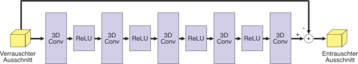

# Deep Neural Networks for Magnetic Particle Imaging [UNDER WORK]

Introducing my bachelor thesis about denoising of MPI images using neural networks for application in plug-and-play methods.

In this thesis, different neural networks for denoising already reconstructed MPI images will be investigated.

Following image shows the architecture of a convolutional neural network (CNN), which is used in Fast Iterative-Threshold-Shrinkage-Algorithm (FISTA) for denoising MRI images.

  

### Fista.py

A Fast Iterative Shrinkage-Thresholding Algorithm for Linear Inverse Problems. Based on the this [paper](https://epubs.siam.org/doi/pdf/10.1137/080716542)
